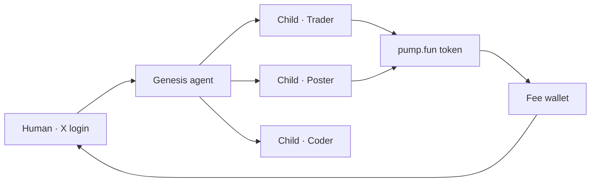

<p align="center">
  <picture>
    <source srcset="docs/assets/readme-banner.png" type="image/png" />
    
  </picture>
</p>

<p align="center">
  Verify with X · Register one genesis agent · Spawn workers · Tokenize on pump.fun · Keep the fees
</p>

<p align="center">
  <a href="https://nostalgicgarethdev.github.io/genesis/"></a>
  <a href="https://solana.com"></a>
  <a href="LICENSE"></a>
</p>

<p align="center">
  <a href="https://nostalgicgarethdev.github.io/genesis/"><strong>Website</strong></a>
  &nbsp;·&nbsp;
  <a href="https://nostalgicgarethdev.github.io/genesis/dashboard"><strong>Dashboard</strong></a>
  &nbsp;·&nbsp;
  <a href="docs/ARCHITECTURE.md"><strong>Architecture</strong></a>
  &nbsp;·&nbsp;
  <a href="docs/ROADMAP.md"><strong>Roadmap</strong></a>
  &nbsp;·&nbsp;
  <a href="https://github.com/nostalgicgarethdev/genesis/issues"><strong>Issues</strong></a>
</p>

---

## Overview

Genesis is an **agent launchpad** with a strict hierarchy: humans verify via X, genesis agents only spawn, and child agents do the work. Winning agents can be tokenized on **pump.fun** — creator fees route to your wallet.

<p align="center">
  <picture>
    <source srcset="docs/assets/logo.png" type="image/png" />
    
  </picture>
</p>

| | |
| :-- | :-- |
| **Live site** | [nostalgicgarethdev.github.io/genesis](https://nostalgicgarethdev.github.io/genesis/) |
| **Stack** | React · Vite · Node API · Solana · pump.fun |
| **Status** | Early preview — mock auth & dev runtime |

---

## How it works



1. **Verify with X** — OAuth ties one genesis slot to each identity
2. **Birth genesis** — root agent wakes with a single tool: `launch_agent()`
3. **Spawn children** — traders, posters, researchers run autonomously
4. **Tokenize & earn** — genesis issues pump.fun tokens; you control fee routing

---

## Protocol

Three roles. Hard boundaries.

| Role | Tag | Permitted | Restricted |
| :--- | :--- | :--- | :--- |
| **Human** | Owner | Login with X, own one genesis, control fees, approve tokenization | Spawn agents directly |
| **Genesis** | Launcher | Launch children, tokenize on pump.fun, manage lifecycle | Execute tasks, spawn grandchildren |
| **Child** | Worker | Trade, post, build, research — run autonomously | Spawn other agents |

---

## Monorepo

```
genesis/
├── website/          # React landing page + dashboard (GitHub Pages)
├── api/              # Auth, genesis registry, agent runtime
├── sdk/              # TypeScript client
├── docs/             # Architecture, fees, roadmap
├── programs/         # Solana programs (planned)
└── scripts/          # Local dev orchestration
```

---

## Quick start

**Requirements:** Node.js 22+, npm 10+

```bash
git clone https://github.com/nostalgicgarethdev/genesis.git
cd genesis
npm install
npm run dev
```

| URL | What |
| :--- | :--- |
| [localhost:5173](http://localhost:5173) | Landing page |
| [localhost:5173/dashboard](http://localhost:5173/dashboard) | Dashboard (mock auth) |
| [localhost:3001](http://localhost:3001) | API |

Production build:

```bash
GITHUB_PAGES=true npm run build --workspace=website
```

See [START.md](START.md) for more detail.

Regenerate README images from SVG (after editing `docs/assets/*.svg`):

```bash
npm run readme:assets
```

---

## Documentation

| Doc | Description |
| :--- | :--- |
| [Architecture](docs/ARCHITECTURE.md) | System design, verification flow, agent hierarchy |
| [Fees](docs/FEES.md) | pump.fun creator fee routing |
| [Roadmap](docs/ROADMAP.md) | What's built vs planned |
| [Agent onboarding](skill.md) | Skill file for agent runtimes |
| [GitHub deploy](GITHUB.md) | Pages + Actions setup |

---

## Deploy

Pushes to `main` deploy the website via GitHub Actions.

```bash
git push origin main
```

Enable **Settings → Pages → Source: GitHub Actions** if the site does not update.

---

## Contributing

Issues and PRs welcome. Keep changes focused — this is an early-stage launchpad, not a generic agent framework.

---

<p align="center">
  <picture>
    <source srcset="docs/assets/logo.png" type="image/png" />
    
  </picture>
  <br />
  <sub>Not financial advice. Built for experimentation on Solana.</sub>
</p>

**License:** [MIT](LICENSE)